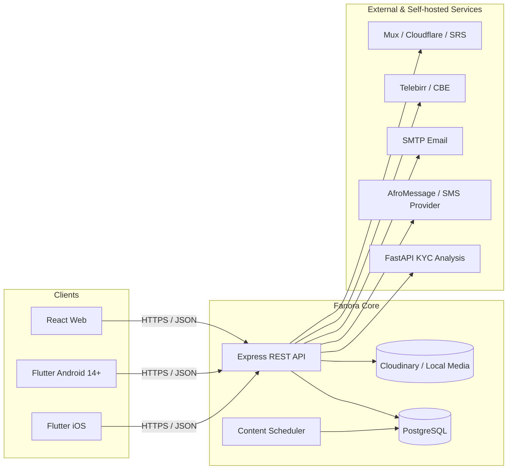
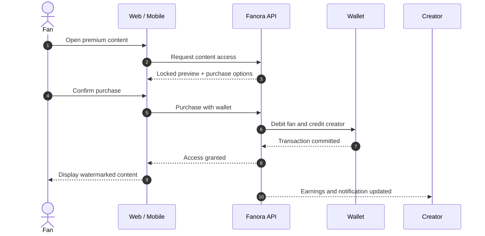
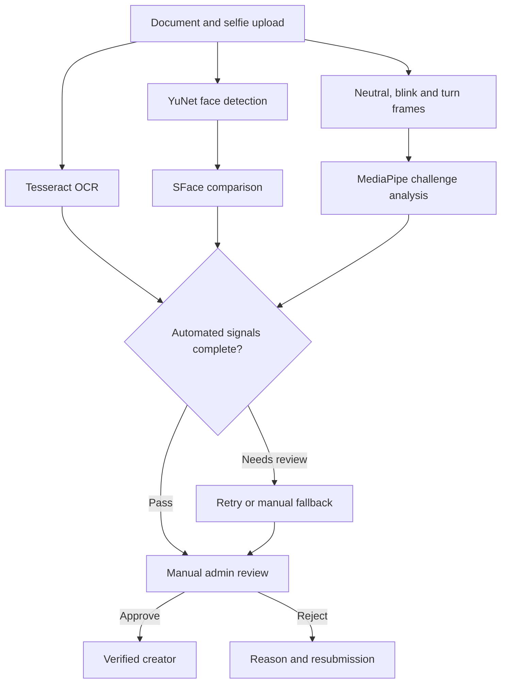

<div align="center">

# Fanora

### A creator-first subscription and digital content platform built for Ethiopia

Connect creators and fans through premium content, subscriptions, messaging, live
streams, local payments, and bilingual experiences across web and mobile.

[](https://react.dev/)
[](https://flutter.dev/)
[](https://nodejs.org/)
[](https://www.postgresql.org/)
[](https://www.docker.com/)
[](#localization)

</div>

> [!IMPORTANT]
> Fanora is an actively developed product. Payment, SMS, live-streaming, email,
> storage, and KYC integrations require production credentials and operational
> review before serving real users.

## What is Fanora?

Fanora is a full-stack creator economy platform designed around the Ethiopian
market. Fans can discover creators, subscribe, purchase pay-per-view content,
send tips, request custom work, and join live experiences. Creators get
publishing, monetization, analytics, audience, messaging, referral, and
verification tools.

The repository contains one shared product across four services:

- **Web** — responsive React/Vite experience with a dark gold design system.
- **Mobile** — Flutter application for Android and iOS.
- **API** — Express and Sequelize REST API backed by PostgreSQL.
- **KYC analysis** — self-hosted FastAPI service for OCR, face comparison, and
  guided liveness signals, followed by mandatory human review.

## Platform architecture



## Product capabilities

| Experience | Implemented capabilities |
| --- | --- |
| Accounts | Email and phone registration, OTP login, email verification, password reset, roles and protected routes |
| Discovery | For-you and following feeds, search, explore, creator profiles, stories and wishlists |
| Monetization | Subscription tiers, PPV content, bundles, tips, paid messages, gifts and custom requests |
| Wallet | Balances, transactions, top-up flows, PIN confirmation and creator earnings |
| Creator studio | Publishing, scheduling, content calendar, content management, subscribers and mass messaging |
| Growth | Audience insights, loyalty indicators, referrals and creator dashboards |
| Communication | Conversations, locked paid messages, notifications and deep links |
| Live | Provider-backed stream creation, RTMP ingest and HLS playback |
| Trust | Reporting, blocking, disputes, moderation queues and admin controls |
| Verification | Document upload, OCR, selfie comparison, blink/head-turn challenge and manual approval |
| Accessibility | Responsive web UI, loading/empty/error states, low-data mode and English/Amharic UI |

## Key workflows



## Technology

| Layer | Stack |
| --- | --- |
| Web | React 18, Vite, React Router, React Query, Tailwind CSS, Headless UI |
| Mobile | Flutter, Dart, Riverpod, Dio, GoRouter, secure storage |
| Backend | Node.js, Express, Sequelize, PostgreSQL, JWT |
| KYC | Python, FastAPI, Tesseract, OpenCV YuNet/SFace, MediaPipe |
| Media | Cloudinary in production; local filesystem fallback for development |
| Streaming | Mux, Cloudflare Live Inputs, or self-hosted SRS |
| Quality | Jest, Flutter Analyzer, Pytest, Vite production builds |

## Repository map

```text
Fanora/
├── Backend/                 # Express API, Sequelize models, routes and tests
├── Frontend/                # React/Vite web application
├── Mobile/                  # Flutter Android and iOS application
├── KycService/              # Dockerized self-hosted identity analysis
├── infra/live/              # SRS live-streaming configuration
├── scripts/                 # Cross-platform development launchers
├── docker-compose.kyc.yml   # Local KYC analysis stack
├── docker-compose.live.yml  # Local RTMP/HLS stack
└── package.json             # Root commands and shared Node dependencies
```

## Quick start

### Prerequisites

- Node.js 18 or newer
- PostgreSQL 14 or newer
- Flutter compatible with Dart `^3.12.1` for mobile development
- Android Studio and an Android 14+ device/emulator
- Docker Desktop for self-hosted KYC and live streaming
- macOS with Xcode for iOS builds

### 1. Install dependencies

```bash
git clone https://github.com/abel2800/Fanora.git
cd Fanora
npm install
cd Mobile && flutter pub get && cd ..
```

Node dependencies are installed once at the repository root. Do not install
separate copies inside `Backend` or `Frontend`.

### 2. Configure the environment

**Windows PowerShell**

```powershell
Copy-Item Backend/.env.example Backend/.env
Copy-Item Frontend/.env.example Frontend/.env
```

**macOS / Linux**

```bash
cp Backend/.env.example Backend/.env
cp Frontend/.env.example Frontend/.env
```

At minimum, update the PostgreSQL credentials and replace `JWT_SECRET` with a
long random value. Never commit `.env` files.

### 3. Prepare PostgreSQL

```bash
cd Backend
npm run db:setup
npm run seed
cd ..
```

### 4. Run Fanora

```bash
npm start
```

This starts the API at `http://localhost:5000`, the web app at
`http://localhost:3000`, and Flutter on a connected Android target when one is
available.

### Development commands

```bash
npm start                 # API + web + Android when available
npm run dev:web           # API + web only
npm run start:api         # API only
npm run start:web         # Web only
npm run start:mobile      # Flutter Android only
npm run test:api          # Backend Jest tests
npm run build:web         # Production web build
npm run analyze:mobile    # Flutter static analysis
```

### Android emulator networking

The Android emulator reaches the host API through
`http://10.0.2.2:5000/api`. Web and desktop clients use
`http://localhost:5000/api`.

## Configuration

The complete configuration template is in `Backend/.env.example`.

| Integration | Development default | Production option |
| --- | --- | --- |
| Media | Local `Backend/uploads` | Cloudinary |
| SMS OTP | Console output | AfroMessage or generic SMS API |
| Payments | Demo confirmation flow | Telebirr and CBE credentials |
| Live streaming | Local/external URL | Mux, Cloudflare or managed SRS |
| Email | Local configuration | SMTP provider |
| KYC | Manual/self-hosted analysis | Hardened self-hosted deployment plus human review |

### SMS OTP

```env
SMS_PROVIDER=afromessage
AFRO_MESSAGE_TOKEN=...
AFRO_MESSAGE_IDENTIFIER_ID=...
AFRO_MESSAGE_SENDER_NAME=Fanora
```

### Live streaming

Run the included SRS development stack:

```bash
docker compose -f docker-compose.live.yml up -d
```

- RTMP ingest: `rtmp://localhost:1935/live/<stream-key>`
- HLS playback: `http://localhost:8080/hls/<stream-key>.m3u8`

For managed streaming, set `LIVE_PROVIDER=mux` or
`LIVE_PROVIDER=cloudflare` and provide the corresponding credentials.

## Self-hosted creator verification



Start the service:

```bash
docker compose --env-file Backend/.env -f docker-compose.kyc.yml up --build -d
curl http://127.0.0.1:8001/health
```

Set a strong `KYC_SERVICE_TOKEN`. For local uploads, use
`KYC_IMAGE_BASE_URL=http://host.docker.internal:5000`. OCR supports English and
Amharic through `KYC_OCR_LANGUAGES=eng+amh`.

The service:

1. extracts document text with Tesseract;
2. compares document and selfie faces with OpenCV YuNet/SFace;
3. evaluates ordered neutral, blink, and head-turn frames;
4. returns decision-support signals to the API; and
5. always requires an administrator to make the final approval decision.

> [!CAUTION]
> This workflow does not authenticate a document against a government database
> and is not a guarantee of identity or anti-spoofing. Production use requires
> consent, retention/deletion policies, accuracy and bias evaluation, encrypted
> storage, access controls, audit logging, and legally compliant human review.

Model sources are pinned to an immutable OpenCV Zoo revision and verified using
SHA-256 during image creation. Third-party notices are available in
`KycService/THIRD_PARTY_NOTICES.md`.

## Content protection

| Platform | Protection |
| --- | --- |
| Android | Requires Android 14/API 34 and reports screenshots while protected content is open |
| iOS | Reports screenshots and overlays a privacy shield during recording and app switching |
| Web | Uses dynamic user watermarks and best-effort capture heuristics |

Android does not expose a reliable equivalent callback for screen recording,
and browsers cannot reliably detect operating-system screenshots. Watermarks,
authorization, short-lived media access, and server-side auditing remain the
primary cross-platform controls.

## Localization

Fanora ships with English and Amharic UI strings on web and mobile. Language
selection is persisted per client, while account privacy and data-saving
preferences are synchronized through the API.

## Validation

```bash
npm run test:api
npm run build:web
npm run analyze:mobile

docker compose --env-file Backend/.env -f docker-compose.kyc.yml \
  run --rm kyc pytest -q
```

Dependency-free KYC policy checks can also run directly:

```bash
cd KycService
python -m unittest discover -s tests -p "test_security.py"
python -m unittest discover -s tests -p "test_model_manifest.py"
```

## Security and operational checklist

- Use unique, rotated JWT, webhook, provider, and KYC service secrets.
- Serve every client and API endpoint over HTTPS.
- Keep production uploads in durable private object storage.
- Validate payment webhooks server-side before crediting wallets.
- Back up PostgreSQL and test restoration procedures.
- Apply least-privilege access to admin, moderation, payout, and KYC data.
- Define retention and deletion schedules for identity documents.
- Monitor failed OTP, login, payment, upload, and verification attempts.

## Contributing

1. Create a focused feature branch.
2. Keep credentials and generated files out of Git.
3. Run the relevant validation commands.
4. Document API or environment changes.
5. Open a pull request with a clear problem statement and test evidence.

---

<div align="center">
Built for Ethiopian creators and the communities that support them.
</div>
